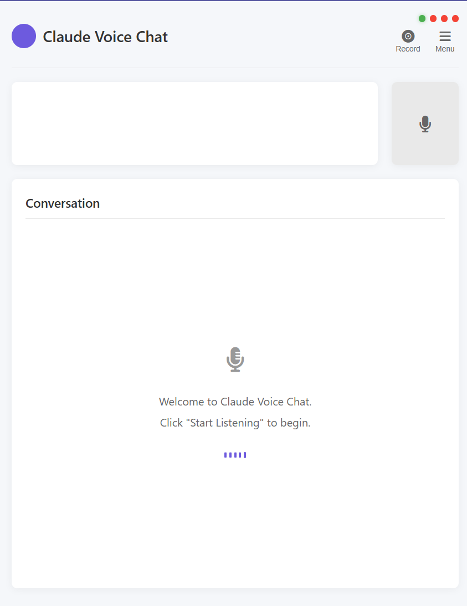

# Claude Voice Chat

<div style="display: flex; align-items: center; gap: 20px;">
<div style="flex: 1;">
A real-time voice chat application using Speechmatics for speech recognition and Claude AI for generating responses.
</div>
<div style="flex: 1;">

</div>
</div>

## Features

- Real-time speech recognition using Speechmatics API
- Intelligent responses from Claude AI
- Simple and intuitive web interface
- WebSocket-based real-time communication

## Prerequisites

- Node.js (v14 or later)
- npm (v6 or later)
- Speechmatics API key
- Claude API key (Anthropic)

## Installation

1. Clone the repository
   ```
   git clone <repository-url>
   cd claude-voice-chat
   ```

2. Install dependencies
   ```
   npm install
   ```

3. Create a `.env` file in the root directory with the following content:
   ```
   SPEECHMATICS_API_KEY=your_speechmatics_api_key_here
   ANTHROPIC_API_KEY=your_anthropic_api_key_here
   PORT=3000
   ```

## Usage

### Local Development

1. Start the server
   ```
   npm start
   ```
   For development with auto-restart:
   ```
   npm run dev
   ```

2. Open your web browser and navigate to `http://localhost:3000`

3. Click the "Start Listening" button and begin speaking

4. The application will transcribe your speech in real-time and show Claude's responses

### Docker Deployment

1. Make sure you have Docker and Docker Compose installed on your server

2. Clone the repository and navigate to the project directory
   ```
   git clone <repository-url>
   cd claude-voice-chat
   ```

3. Create a `.env` file with your API keys

4. Build and start the Docker container
   ```
   docker-compose up -d
   ```

5. The application will be available at `http://<your-server-ip>:3000`

### Environment Variables

- `SPEECHMATICS_API_KEY`: Your Speechmatics API key
- `ANTHROPIC_API_KEY`: Your Claude API key from Anthropic
- `PORT`: The port on which the server will run (default: 3000)

## Architecture

### Backend

- Node.js with Express
- WebSocket server for real-time communication
- Integration with Speechmatics and Claude APIs

### Frontend

- HTML/CSS/JavaScript
- Web Audio API for audio capture
- WebSocket client for real-time communication

## Future Enhancements

- Text-to-Speech functionality to give Claude a voice
- Note-taking and task list creation from meeting content
- Real-time information retrieval during meetings

## License

ISC